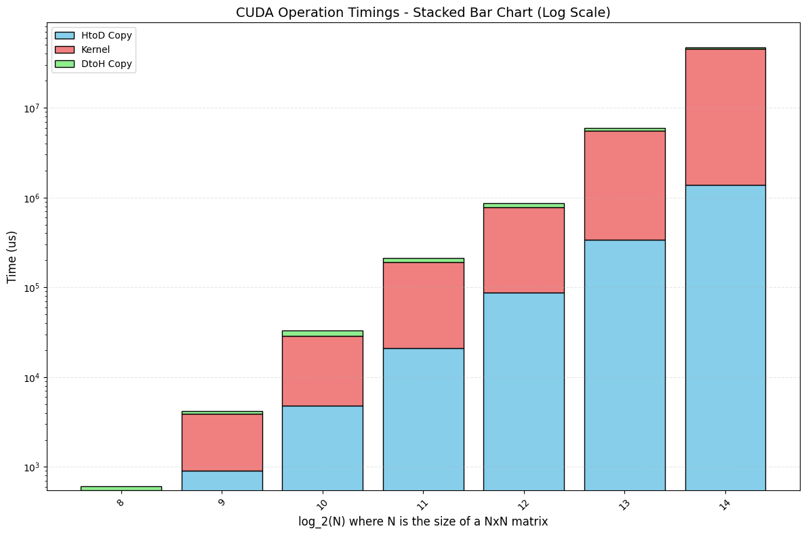
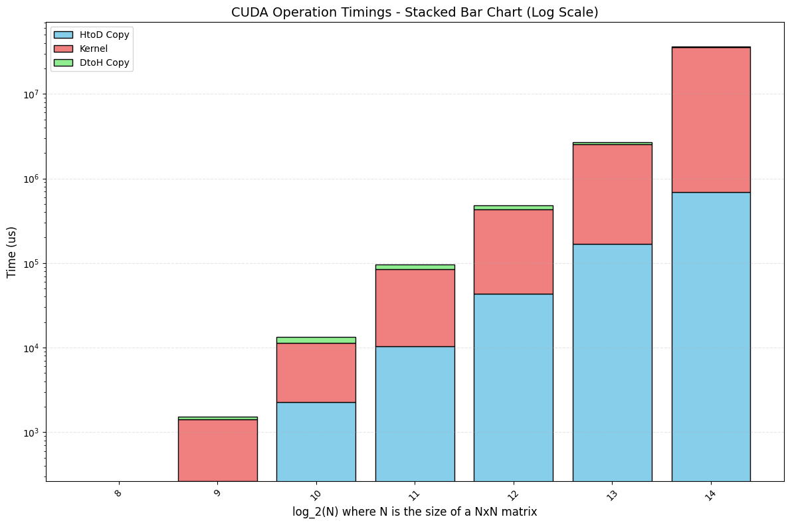

# Assignment 1: GPU Architecture and CUDA Basics

- Assignment Group 3
- Giovanni Prete and Max Harrison

# Question 1 - Reflection on GPU-Accelerated Computing
## 1) Architectural differences between GPUs and CPUs

Three main architectural differences between GPUs and CPUs:

1) Specialised vs. general: CPU must be highly general, so they have much more hardware and infrastructure for control flow. They need to be able to handle a wide array of instructions and essentially any kind of computational work. GPUs are more specialised for arithmetic work, so they have many more ALUs (arithmetic logic units) than CPUs. They don't need to handle the same variety as CPUs, so they have much less infrastructure for control flow. 
2) Many cores vs. few: CPU cores must be highly flexible in order to provide this generality, making them more expensive. As GPU cores can be more specialised, they are cheaper in both cost and power requirements. This allows GPUs to have many more cores than CPUs.
3) Versions of efficiency: CPUs and GPUs have different models of efficiency for which their architectures are optimised for. CPUs have a latency-oriented architecture: they are designed in order to minimise the latency of single tasks. Data is not necessarily local, so CPUs require large caches to reduce latency. Contrastingly, GPUs have a throughput-oriented architecture: it is designed to maximise the total amount of computation in a given amount of time. Access to data is regular, so there is no need for large caches.

## 2) Supercomputers that use GPUs

Almost all of the top 10 supercomputers use some form of GPU accelerator, whether in a discrete GPU or in an accelerator containing both CPU and GPU cores (like the AMD Instinct series).

The name of the supercomputer and their GPU vendor is provided in the table below:

| Supercomputer Name | Accelerator Vendor | Accelerator Model |
| ------------- | -------------- | -------------- |
| El Capitan | AMD | Instinct MI300A | 
| Frontier | AMD | Instinct MI250X |
| Aurora | Intel | Data Center GPU Max |
| JUPITER Booster | NVIDIA |  GH200 Superchip |
| Eagle | NVIDIA | H100 | 
| HPC6 | AMD | Instinct MI250X |
| Supercomputer Fugaku | - | - | 
| Alps | NVIDIA | GH200 Superchip |
| LUMI | AMD | Instinct MI250X |
| Leonardo | NVIDIA | A100 SXM4 64 GB | 

The "Supercomputer Fugaku" is the only system on the list to not use accelerators.

## 3) Power efficiency

Power efficiency is quantified by Performance / Power, e.g. throughput as in FLOPs per watt power consumption.
The power efficiency for the top 10 supercomputers is provided below:

| Supercomputer Name | Power Efficiency (GFlops/Watt) |
| ------------- | -------------- | 
| El Capitan | 58.89 | 
| Frontier | 54.98 |
| Aurora | 26.15 |
| JUPITER Booster | 60.62 | 
| Eagle | - |
| HPC6 | 56.48 | 
| Supercomputer Fugaku | 14.78 | 
| Alps | 61.05 | 
| LUMI | 53.43 | 
| Leonardo | 32.19| 

We note that the only system to not use accelerators in the top 10, the "Supercomputer Fugaku", has a much lower power efficiency than the other systems. The "Aurora" system also has a relatively low power efficiency, and is the only one to use Intel accelerators.

# Question 2 - Your First CUDA Program and GPU Performance Metrics
## 1) 

The code is contained in `Q2/vecAdd.cu` with the corresponding comments.

## 2) 

For each cell in the vector, two reads and one operation is performed. Thus, for a vector length of $N$ we have that $N$ floating operations and $2N$ memory reads are being performed by the kernel.

## 3)

The threads per block is set to 32 for all inputs, so for $N = 512$ there are $N/32 = 16$ thread blocks and $512$ CUDA threads.

## 4)

For $N=512$, there was an achieved occupancy of 3.21%.

## 5)

The program still works as originally written.

## 6)

For $N = 263,149$, there are $N/32 = 8,224$ thread blocks (as we round up to the nearest whole number) and $8,224 \cdot 32 = 263,168$ CUDA threads.

## 7)

For $N=263,149$, there was an achieved occupancy of 35.02%.

## 8)

Further increase the vector length (try 10-16 different vector length), plot a stacked bar chart showing the breakdown of time including (1) data copy from host to device (2) the CUDA kernel (3) data copy from device to host. For this, you will need to add simple CPU timers to your code regions (see tutorial).


# Question 3 - 2D Dense Matrix Multiplication

## 1) Number of floating-point operations

For each element `C[i][j]` in the resulting matrix, the kernel computes the dot product between the `i`-th row of matrix `A` and the `j`-th column of matrix `B`.  
Each dot product involves `numAColumns` multiplications and `numAColumns - 1` additions.  
Thus, the total number of floating-point operations (FLOPs) is:

FLOPs = numARows × numBColumns × (2 × numAColumns - 1)

Since each output element requires one multiply-add operation per element of the row/column pair, the complexity is O(M×N×K), where M, N, and K correspond to numARows, numBColumns, and numAColumns respectively.

---

## 2) Number of global memory reads

In a naive matrix multiplication kernel, each thread reads:
- `numAColumns` elements from one row of `A`
- `numAColumns` elements from one column of `B`

Therefore, the total number of global memory reads is:

Reads = numARows × numBColumns × (numAColumns + numBRows)

Since numBRows = numAColumns, this simplifies to:

Reads = 2 × numARows × numBColumns × numAColumns

This is because each thread needs to access both the elements of A and B for its assigned output element.

---

## 3) For A(128×256) and B(256×32)

Each element of the resulting matrix C(128×32) is computed by one thread.  
If each block is configured as 16×16 threads:

- Grid size = (ceil(32/16), ceil(128/16)) = (2, 8)
- Total thread blocks = 2 × 8 = 16
- Threads per block = 16 × 16 = 256
- Total CUDA threads = 16 × 256 = 4,096

**Achieved Occupancy (from Nvidia Nsight): 24.00%**

This relatively low occupancy is due to high register or shared memory usage per block, which prevents full utilization of all warps on each SM.

---

## 4) For A(1024×8191) and B(8191×8197)

### 1)
The program still works as originally written


### 2)
From launch configuration:
``` cpp
dim3 blockSize(16, 16);
dim3 gridSize((8197 + 15) / 16, (1024 + 15) / 16);
```

So:
```
blockSize.x = 16, blockSize.y = 16 → 256 threads per block
gridSize.x = 513 (since 8197/16 ≈ 512.31 → 513)
gridSize.y = 64 (since 1024/16 = 64)
```

Total number of blocks:
```
513 × 64 = 32,832 blocks
```
Total number of threads:
```
32,832 × 256 = 8,404,992
```


### 3)

Not all threads compute valid output elements — only those within the valid matrix dimensions (N×P).
Matrix C has dimensions ```1024 × 8197 = 8,392,148``` elements and the total threads launched are 8,404,992.
So:
```
Threads that perform computation = 8,392,148
Threads that do nothing = 8,404,992 - 8,392,148 = 12,844
```
These “extra” 12,844 threads are created because the grid is padded to multiples of 16 to fit the 16×16 block structure.


### 4)
Nvidia Nsight output:
```
Section: Occupancy
    ------------------------------- ----------- ------------
    Metric Name                     Metric Unit Metric Value
    ------------------------------- ----------- ------------
    Block Limit SM                        block           16
    Block Limit Registers                 block            4
    Block Limit Shared Mem                block           16
    Block Limit Warps                     block            4
    Theoretical Active Warps per SM        warp           32
    Theoretical Occupancy                     %          100
    Achieved Occupancy                        %        98.67
    Achieved Active Warps Per SM           warp        31.57
    ------------------------------- ----------- ------------
```
**Achieved Occupancy (from Nvidia Nsight): 98.67%**

---

## 5) Time chart


Stacked bar chart showing the execution time breakdown for NxN matrix multiplication. The x-axis represents log_2(N) where N is the matrix dimension (side length).

As matrix size increases, kernel execution time dominates, while memory transfer times become relatively smaller in proportion. This indicates that GPU computation scales better than memory transfer bandwidth.

---

## 6) Time chart with float DataType



We generally observe a significant speed-up because `float` operations use less bandwidth (4 bytes vs 8 bytes per element)


# 4 - Rodinia CUDA Benchmarks and Comparison With CPU
