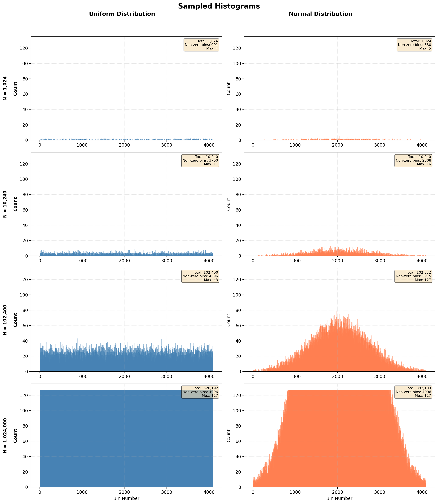

# Assignment 2: CUDA Basics

- Assignment Group 3
- Giovanni Prete and Max Harrison

Both had equal contributions.

## Question 1 - Shared Memory and Atomics

### 1)

Looking at the `nvprof` profiling, the majority of the time is spent copying data between the host and the device, so optimising the code won't have such a big effect on the total runtime. There are however some possible optimisations:

1) Private histograms: initial histogram uses global atomic adds to update the bins, which is quite slow if multiple threads are trying to access the same bin at once. Instead we can use shared memory to create private histograms, and then merge the private histograms at the end. This decreases the amount of thread contention at the cost of creating an additional merging step.
2) Increased block size: increasing the number of threads per block from just 32. We can achieve better occupancy and warp utilisation with bigger blocks, e.g. 128-256 threads per block. There isn't really a tradeoff here as the problem is inherently highly parallelisable, so there isn't a tradeoff in increasing the block size.
3) Coalesce memory accesses: in the `histogram_kernel`, the read `bins[input[i]]` happens without the `bins` read being coalesced - threads in the same block will probably access very different locations in the array. This results in multiple scattered memory transactions and poor cache utilisation. A possible optimisation is to preprocess the input list by sorting it in order. Then the `bins` reads will be close together in the same block. However, this is likely to cause more thread contention in the same block (diminishing the effect of private histograms as above) and we also have to tradeoff on the additional compute required for the sorting action.

### 2)

In the end, we only applied the second optimisation of increasing the block size. The other optimisations had to big an overhead for the test cases we are using them. Maybe for much larger lists they would have a bigger effect, but for these small sizes the overhead of merging the private histograms and sorting the data is too great.

### 3)

On a given run, each input is read, the corresponding bin value is read, and then the incremented bin value is written. The `convert_kernel` then reads each bin once to check if it exceeds 127 and writes to it if it does.
This means that given $N$ inputs, one run will have $2N+4096$ reads and $N+4096$ writes (in the worst case where each bin exceeds 127, otherwise at least $N$ writes).

### 4)

One atomic add is performed per input, so given $N$ inputs there are $N$ atomic operations.

### 5)

No shared memory is used in the code by the above reasoning: the global atomic adds were faster than merging private histograms for our test values given during profiling.

### 6)

Values pulled from the uniform distribution should have no structure to them: any value is as likely as any other. Contrastingly, values pulled from the normal distribution will be heavily weighted towards the centre of the distribution. This closeness of values will affect the code in two ways:

1) Closer input values result in coalesced memory accesses. Single memory accesses will suffice for close input values as this means that the same cache line will contain both values.
2) Closer input values result in more likely collisions and thread contention. If two threads have to update the same bin at the same time, they will both need to atomically update the bin causing a larger degree of thread contention. This will be slower than spread out bin values where different threads can independently access different bins.

### 7)

The sampled histograms are shown in Figure 1.

### 8)

Running the command `ncu ./histogram 1024 Uniform` we get:

- Shared Memory Configuration Size: 32 Kb
- Achieved Occupancy: 22%

## Question 2 - Reduction

### 1)

Describe all optimizations you attempted, and whether they improved or hurt performance.

### 2)

Which optimizations did you choose in the end and why?

### 3)

How many global memory reads and writes are performed in total in one run? Explain your answer.

### 4)

Do you use atomic operations? If so, how many atomic operations are performed in total? Explain your answer.

### 5)

Do you use atomic operations? If so, how much shared memory is used in your code? Explain your answer.

### 6)

Run your program on array lengths starting from 512 and increasing at x2 rate for 8-10 runs. Plot a bar chart to visualize the time taken by CPU and GPU for each run.

### 7)

Do you observe any speed from using GPU? Why or why not?

### 8)

Using the largest array size in 6, profile and report Shared Memory Configuration Size and Achieved Occupancy. Describe one optimization that you would like to try.

## Question 3 - Tiled Matrix Multiplication

How many global memory reads are performed by the tiled_gemm() kernel?  Compare it with that of the gemm() version.
Run with your program with a matrix A of (1024x1024) and B of (1024x1024), select 3 tile sizes for testing. Include the screenshot of your output. Explain the results.
Run with your program with a matrix A of (513x8192) and B of (8192x1023), select 3 tile sizes for testing. Include the screenshot of your output. Explain the results.
Profile your program in 2 and 3. Report Achieved Occupancy and Shared Memory usage.
Run your program with 8-10 different matrix sizes that increases from small size to larger sizes. Plot a bar chart comparing the runtime of the CPU version, the gemm(), and the three tiled gemm() kernels of these problems. Explain your results.
