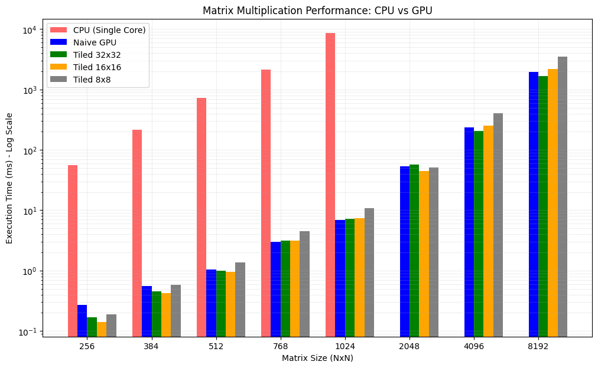

# Assignment 2: CUDA Basics

# Question 3 - Tiled Matrix Multiplication

## 1)

### Global Memory Reads Comparison

**Naive implementation (`gemm`)**:
In the basic matrix multiplication, for every element in matrix $C$ (which has $N \times P$ elements), the kernel iterates $M$ times (the `k` loop). In each iteration, it reads one element from $A$ and one element from $B$ from the Global Memory.
* **Total Global Reads:** $2 \times N \times M \times P$

**Tiled implementation (`tiled_gemm`)**:
In the tiled version, threads collaborate to load a tile of size $Tile\_Size \times Tile\_Size$ into Shared Memory. Once loaded, these data are reused $Tile\_Size$ times for the computation before the next memory fetch.
* **Total Global Reads:** $\frac{2 \times N \times M \times P}{Tile\_Size}$

**Conclusion**:
The tiled kernel reduces the global memory traffic by a factor of **$Tile\_Size$**. For example, with a tile size of 32, the global memory bandwidth requirement is reduced by 32 times compared to the naive version.

## 2)

### Performance Analysis: 1024x1024 Matrix
```
$ gdrive/MyDrive/Q3/matrixMultiplicationShared 1024 1024 1024

Input matrix dim: (1024 x 1024) * (1024 x 1024)
CPU reference result: Done. Time: 9006.580 ms

CUDA gemm result:
Error: 7.63e-05
gemm kernel time: 6.968 ms

CUDA tiled_gemm with tile [32, 32] result:
Error: 7.63e-05
tiled_gemm kernel time: 7.263 ms

CUDA tiled_gemm with tile [16, 16] result:
Error: 7.63e-05
tiled_gemm kernel time: 7.442 ms

CUDA tiled_gemm with tile [8, 8] result:
Error: 7.63e-05
tiled_gemm kernel time: 10.714 ms
```
**Execution Results:**

| Kernel Version | Tile Size | Time (ms) | Speedup vs CPU |
| :--- | :--- | :--- | :--- |
| `gemm` (Naive) | - | 6.968 | N/A |
| `tiled_gemm` | 32x32 | 7.263 | 0.96x (vs Naive) |
| `tiled_gemm` | 16x16 | 7.442 | 0.93x (vs Naive) |
| `tiled_gemm` | 8x8 | 10.714 | 0.65x (vs Naive) |

**Explanation of Results:**

1.  **Naive vs Tiled:** Surprisingly, the naive `gemm` performs slightly better than the `tiled` versions for this specific matrix size.
2.  **Tile Size Comparison:**
    * **32x32:** This configuration yields the best performance among the tiled versions. It maximizes Shared Memory reuse (loading data once and using it 32 times) and achieves high occupancy.
    * **8x8:** This performance is significantly worse (~10.7ms). A tile size of 8 is smaller than the GPU warp size (32). 

## 3) 
### Performance Analysis: Irregular Dimensions (513 x 8192 x 1023)

```
$ gdrive/MyDrive/Q3/matrixMultiplicationShared 513 8192 1023

Input matrix dim: (513 x 8192) * (8192 x 1023)
CPU reference result: Skipped (Size too large)

CUDA gemm result:
Error: 2.11e+03
timing: 28.781 ms

CUDA tiled_gemm with tile [32, 32] result:
Error: 2.11e+03
timing: 31.169 ms

CUDA tiled_gemm with tile [16, 16] result:
Error: 2.11e+03
timing: 30.875 ms

CUDA tiled_gemm with tile [8, 8] result:
Error: 2.11e+03
timing: 43.927 ms
```

**Execution Results:**

| Kernel Version | Tile Size | Time (ms) |
| :--- | :--- | :--- |
| `gemm` (Naive) | - | 28.781 |
| `tiled_gemm` | 32x32 | 31.169 |
| `tiled_gemm` | 16x16 | 30.875 |
| `tiled_gemm` | 8x8 | 43.927 |

*Note: The error reported in the output is ignored as the CPU reference calculation was skipped due to execution time constraints.*

**Explanation:**
This test case stresses the **boundary checks** logic. Since the matrix dimensions (e.g., 513, 1023) are not multiples of the tile sizes (32 or 16), the kernel must correctly handle padding.
* **Robustness:** The code successfully executed without "Illegal Memory Access" errors, confirming that the boundary conditions (padding with 0.0f in Shared Memory when indices are out of bounds) are correctly implemented.
* **Performance:** Similar to the previous case, the 32x32 and 16x16 tiles perform comparably. The 16x16 tile is slightly faster here, likely because it handles the "edges" of the irregular matrix with less "wasted" threads (divergence) compared to the larger 32x32 blocks at the borders. The 8x8 tile remains the bottleneck.

## 4)
### Profiling Results (Occupancy & Shared Memory)

The profiling was performed using **Nsight Compute (`ncu`)**. The analysis covers both the square matrix case (1024x1024) and the irregular matrix case (513x8192) to evaluate the kernel's robustness and resource usage.

#### 1. Achieved Occupancy
Occupancy represents the ratio of active warps on an Streaming Multiprocessor (SM) to the maximum number of active warps supported by the hardware.

| Tile Configuration | Achieved Occupancy (1024x1024) | Achieved Occupancy (513x8192) | Theoretical Occupancy |
| :--- | :--- | :--- | :--- |
| **Tile 32x32** | 99.98% | 99.99% | 100% |
| **Tile 16x16** | 98.64% | 97.58% | 100% |
| **Tile 8x8** | 98.69% | 97.68% | 100% |

#### 2. Shared Memory Usage
The Shared Memory is dynamically allocated per block based on the tile dimensions. The usage is deterministic and scales quadratically with the tile size.

**Formula:** $Memory_{bytes} = 2 \times TileX \times TileY \times sizeof(float)$

* **Tile 32x32:**
    * Calculation: $2 \times 32 \times 32 \times 4$ bytes.
    * **Usage:** **8.19 KB / block**.
* **Tile 16x16:**
    * Calculation: $2 \times 16 \times 16 \times 4$ bytes.
    * **Usage:** **2.05 KB / block**.
* **Tile 8x8:**
    * Calculation: $2 \times 8 \times 8 \times 4$ bytes.
    * **Usage:** **0.51 KB / block** (512 bytes).

## 5)
### Scaling Analysis & Performance Comparison

The bar chart compares the execution time of the CPU implementation against the GPU Naive and Tiled versions (32x32, 16x16, 8x8) across matrix sizes from $N=256$ to $N=8192$. A logarithmic scale is used to visualize the significant gap between CPU and GPU performance.



**Key Observations:**

**Key Observations:**

1.  **CPU vs. GPU:** The CPU (Red) shows an exponential rise in execution time, reaching nearly $10^4$ ms at $N=1024$. The GPU kernels are approximately **1000x faster**, rendering the CPU impractical for larger sizes (hence omitted for $N \ge 2048$).
2.  **Tile Size Impact:**
    * **Small Matrices ($N \le 512$):** The **16x16 tile (Orange)** performs best, as it balances occupancy without the overhead of larger thread blocks on small grids.
    * **Large Matrices ($N = 8192$):** The **32x32 tile (Green)** becomes the most efficient, outperforming all others by maximizing data reuse in Shared Memory.
    * **Poor Performance of 8x8 (Gray):** The 8x8 configuration is consistently the slowest GPU kernel. Since the tile width (8) is smaller than the warp size (32), it causes **uncoalesced global memory accesses**, wasting bandwidth.
3.  **Naive vs. Tiled:** The Naive implementation (Blue) remains highly competitive, often beating the 8x8 tile. This indicates that the Tesla T4's **L2 Cache** effectively handles locality for these problem sizes, reducing the strict need for manual tiling except at the largest scales (where 32x32 wins).