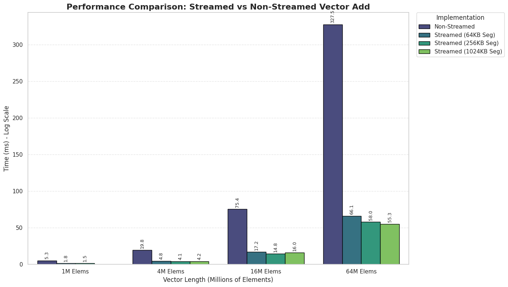
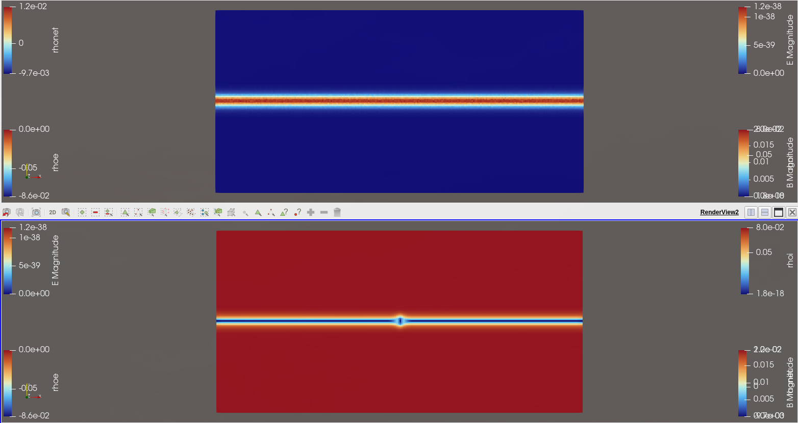
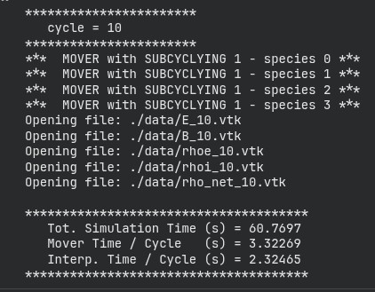
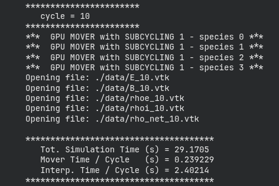

# Assignment 3: CUDA Advanced

- Assignment Group 3
- Giovanni Prete and Max Harrison

Both had equal contributions.

## Question 1 -  Thread Scheduling and Execution Efficiency

### 1)

With an image size of $800 \times 600$ and a block size of $64 \times 16$, the grid dimensions are calculated as $\lceil 800/64 \rceil = 13$ blocks along the x-axis and $\lceil 600/16 \rceil = 38$ blocks along the y-axis, resulting in a total of 494 blocks. Since each block contains $1024$ threads ($64 \times 16$), which equates to 32 warps, the total number of warps generated is $494 \times 32 = 15,808$. regarding control divergence, warps are formed along the x-dimension. Because the image width of 800 is a perfect multiple of the warp size 32 ($800 \pmod{32} = 0$), the image boundary aligns perfectly with the end of a warp. Consequently, every warp is either entirely within the image bounds or entirely outside, meaning **0 warps** will experience control divergence.

### 2)

With dimensions changed to $600 \times 800$, the grid layout changes to $\lceil 600/64 \rceil = 10$ blocks in width and $\lceil 800/16 \rceil = 50$ blocks in height. The boundary condition at $X=600$ now splits a warp. In the last column of blocks, the pixel indices start at 576. The first warp of each row covers indices 576 to 607. Since the valid range ends at 599, the first 24 threads in this warp evaluate the condition to true, while the last 8 threads evaluate to false, causing divergence. The second warp in the row is fully out of bounds and does not diverge. Since there is one divergent warp for every row, and there are 16 rows per block across 50 blocks along the vertical edge, the total number of warps with control divergence is $1 \times 16 \times 50 = \mathbf{800}$.

### 3)

For $X=600$ and $Y=899$, the logic for x-axis divergence remains identical to the previous case, but the number of blocks along the y-axis increases to $\lceil 899/16 \rceil = 57$. We must calculate the divergence for the first 56 full blocks separately from the final block. For the first 56 blocks along the vertical edge, every row contains one divergent warp, contributing $56 \times 16 = 896$ divergent warps. In the 57th and final block, only the first 3 rows (indices 896, 897, 898) are within the vertical limit $Y < 899$. These 3 rows will exhibit the x-axis divergence described previously. The remaining 13 rows of that block are entirely out of vertical bounds, so the condition fails for all threads and no divergence occurs. Summing these values gives a total of $896 + 3 = \mathbf{899}$ divergent warps.

## Question 2 - CUDA Streams

### 1)

The experimental results demonstrate a significant performance gain when using CUDA streams compared to the non-streamed implementation. Across all tested vector lengths, the streamed version consistently outperforms the synchronous version, achieving speedups ranging from approximately **3.5x** for smaller vectors to nearly **6x** for the largest datasets. For instance, at a vector length of 67,108,864 elements, the execution time drops drastically from 327.53 ms in the non-streamed version to just 55.32 ms in the best streamed configuration.

### 2)

The execution trace was collected using NVIDIA Nsight Systems on the Google Colab environment. The visualization in Figure 2 confirms the successful implementation of asynchronous execution. Specifically, we can observe the concurrency where memory copy operations (green blocks, HtoD) overlap with kernel execution (blue blocks) across different streams, effectively hiding data transfer latency.

### 3)

As illustrated in Figure 1 (referring to the grouped bars for the largest vector), analyzing the impact of the segment size ($S_{seg}$) reveals a trade-off between overlap efficiency and API overhead. The smallest tested segment size (65,536) generally yields slightly higher execution times compared to larger segments (e.g., 66.09 ms vs 55.32 ms for the 67M vector), likely due to the overhead of managing a higher number of kernel launches and memory transactions. The "sweet spot" appears to shift as the total vector length increases: for moderate vector lengths (1M - 4M), the medium segment size (262,144) offers the best performance, while for the largest vector length (67M), the largest segment size (1,048,576) provides the optimal throughput. This suggests that as the total workload increases, larger chunks are preferable to fully saturate the PCIe bus and compute resources without incurring excessive launch overheads.

## Bonus - A Particle Simulation Application

The goal of this task was to create a GPU implementation of the `mover_PC()` function in the provided plasma simulation. The code for this section can be found in the `./Bonus/` directory together with a Google Colab notebook for running the simulation. The important GPU-relevant code is contained in `./Bonus/iPIC3D-mini/src/Particles.cu` The important GPU-relevant code is contained in `./Bonus/iPIC3D-mini/src/Particles.cu`.

### 1)

We used a Google Colab notebook to compile the code and run the simulation. The Makefile was modified to have two targets `cpu` & `gpu` that utilise pre-processor definitions in order to compile either the CPU or GPU versions of `mover_PC()`. This allows one to simply run `make [version]` and then execute the compiled binary to run the simulation.

### 2)

The GPU implementation of `mover_PC()` is based of the simple observation that the particle evaluation in the three loops section of `mover_PC()` does not require information flow between the particles, and thus is very easily moved to the GPU. We can simply define an additional GPU kernel for which this computation is done, and pass the objects to the kernel (even though this results in very ugly parameter slush).
To deal with the GPU memory, we allocate corresponding data structures on the GPU for the original CPU structs and then copy across flattened versions of the structs. This is again an ugly solution but will pass across the required data to the GPU.

### 3)

The visualisation shows the output from the purely CPU-implemented version on the top, where the bottom part is the output from the GPU-implemented version. There are large differences in the two outputs, likely  largely due to rounding errors caused by the different architectures.

### 4)

Sample simulation output is shown in the two following figures:

The CPU version takes around 60 seconds to execute, where the GPU version takes around 30. This represents a 2x speedup for a very simple port, which is a large improvement. Further improvements are available as well e.g. by utilising streams to overlap memory transfer times.
