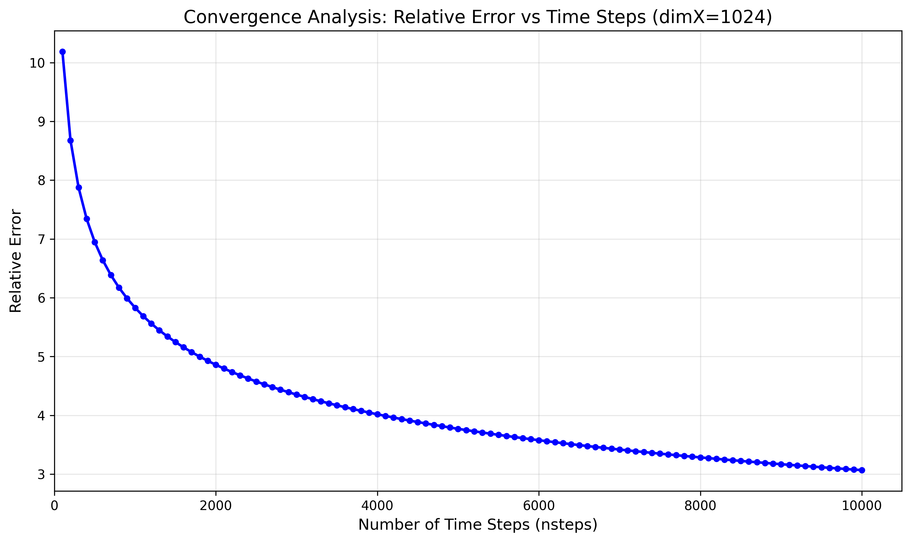

# Assignment 4: Programming Productivity

- Assignment Group 3
- Giovanni Prete and Max Harrison

Both had equal contributions.

## Question 1 -  1D Convolution

## Question 2 - NVIDIA Libraries and Managed Memory

### 1)

To approximate the FLOPS achieved in computing the SMPV, we can find the theoretical required number of floating-point operations required to compute the SMPV and then find the approximate time spent executing the SMPV. If we divide the theoretical number of FLOP's by the approximate time we can find the approximate FLOPS achieved during execution. This will not be exact due to the inaccuracy of time measurement and the likely more required FLOP's required by the actual cuSPARSE implementation.

By the definition of the diffusion matrix $A$ and the time step vector `tmp`, we can see that to compute the SMPV for a given time step we will need to perform 4 operations per element, for $dimX-2$ elements (as the first and last row in `tmp` are the constant 0). Thus for the entire computation we will need to perform $nsteps \cdot 4(dimX-2)$ FLOP's.
To approximate the time taken to compute the SMPV, we can utilise CUDA events to take time measurements before and after evaluation. Aggregating the individual time intervals over the time steps then results in a total execution time for computing the SMPV over the entire computation.

| dimX | SPMV time (s) | FLOPS (op/s) |
|------|---------------|--------------|
| 1024 | 0.0261 | 156,676,375.90 |
| 2048 | 0.0247 | 331,617,974.80 |
| 4096 | 0.0253 | 64,668,4831.97 |
| 8192 | 0.0235 | 1,393,746,011.49 |
| 16384 | 0.0299 | 2,192,158,437.04 |
| 32768 | 0.0252 | 5,210,670,695.34 |
| 65536 | 0.0334 | 7,849,793,376.06 |
| 131072 | 0.0486 | 10,791,429,100.71 |
| 262144 | 0.0957 | 10,953,504,162.79 |
| 524288 | 0.1734 | 12,095,720,935.06 |

As dimX increases, the measured SPMV time increases as expected due to the larger workload. In addition, the approximate FLOPS increases: this is likely due to the decreased ratio of overhead of calling the various kernels involved in the cuSPARSE implementation.

### 2)

Running the program 100 times with dimX=1024 for nsteps from 100 to 10000, we can find how the relative error of the approximation changes as the number of time steps increases in the following plot:

We can see from the plot that the relative error seems to converge as the number of time steps increases. Initially there are large decreases in relative error, but these decreases are smaller for the later time steps. This aligns with our intuition of a diffusion system as the system converges to a stable solution.

### 3)

The below table shows the average execution time over 20 iterations for various dimX sizes, with and without prefetching.

| dimX | Without prefetching (s) | With prefetching (s) |
|------|-------------------------|----------------------|
| 64 | 0.452827 | 0.441194 |
| 128 | 0.470727 | 0.383741 |
| 256 | 0.472843 | 0.403734 |
| 512 | 0.481950 | 0.452170 |
| 1024 | 0.531924 | 0.427101 |
| 2048 | 0.493554 | 0.427965 |
| 4096 | 0.516902 | 0.454684 |
| 8192 | 0.506130 | 0.422726 |
| 16384 | 0.490952 | 0.447741 |
| 32768 | 0.537801 | 0.438596 |

There seems to be a slight decrease in execution time with prefetching, with this difference being more pronounced for larger input values. This aligns with our intuition that as the required data for computation increases in size, the penalty of having to move data across devices increases as well.
